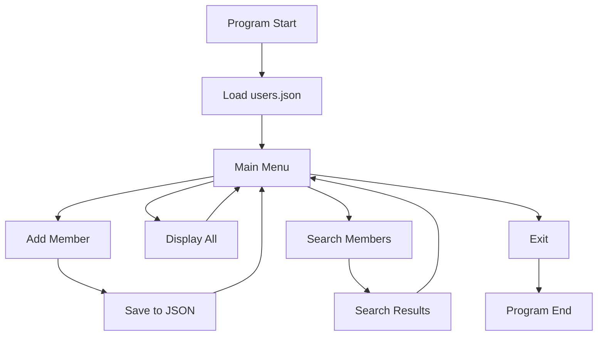

> 🎓 This project demonstrates proficiency in Object-Oriented Programming, file handling, data persistence, and user interface design.

# 🏋️‍♂️ Gym Membership Management System

A comprehensive command-line application for managing gym memberships with persistent data storage. Built with Python's core libraries for efficient member registration, tracking, and search functionality.

## 🚀 Key Features

### Core Functionality
- **Member Registration**: Add new gym members with complete profile information
- **Data Persistence**: Automatic JSON file storage for member data retention
- **Advanced Search**: Multi-criteria search system (ID, Name, Status)
- **Member Status Tracking**: Track active/inactive membership statuses
- **Cross-Platform**: Compatible with Windows, macOS, and Linux systems

### Technical Highlights
- **Object-Oriented Design**: Clean User class implementation
- **Error Handling**: Robust file operations with exception handling  
- **Memory Management**: Efficient data loading/saving operations
- **User Experience**: Clear screen functionality and intuitive navigation
- **Input Validation**: Handles edge cases and invalid user input

## 🛠️ Technical Architecture

### Built With
- **Python 3.x** - Core programming language
- **JSON Module** - Data serialization and storage
- **OS Module** - Cross-platform screen clearing
- **Time Module** - User experience timing controls

### System Design
```
📁 Gym Management System
├── 🗃️ Data Layer
│   ├── User Class (OOP Model)
│   ├── JSON File Storage
│   └── Data Persistence Functions
├── 🔧 Business Logic
│   ├── Member Registration
│   ├── Search Algorithms
│   └── Status Management
└── 🖥️ Presentation Layer
    ├── Command-Line Interface
    ├── Menu Navigation
    └── Screen Management
```

### Data Flow


## 💼 Business Value

This system provides:
- **Operational Efficiency**: Streamlined member management
- **Data Security**: Local file-based storage with JSON format
- **Scalability**: Easy to extend with additional features
- **Cost-Effective**: No database dependencies or external services
- **User-Friendly**: Intuitive command-line interface

## 💼 Why this Project?

This system is great for:
- Practicing Python basics with a real use case
- Understanding how to store and retrieve data
- Building logic around simple user input and output

## 🎯 Installation & Usage

### Prerequisites
```bash
# Python 3.6+ required
python --version
```

### Quick Start
1. **Clone the repository:**
   ```bash
   git clone https://github.com/HmodyCode999/Gym-Membership-Management.git
    cd Gym-Management-Manger
   ```

2. **Run the application:**
   ```bash
   python GMM.py
   ```

3. **First-time setup:**
   - The system automatically creates `users.json` on first run
   - No additional configuration required

### Usage Examples

#### Adding a New Member
```
Choose an Action:
1. Add new member

Enter first name: Ahmed
Enter last name: Hassan
Enter membership ID: GYM001
Enter membership status: active
```

#### Searching Members
```
Search by:
1. Membership ID     → Find specific member
2. First Name        → Find by name
3. Membership Status → Filter by active/inactive
```

## 📊 System Capabilities

### Member Data Management
- **Profile Storage**: First name, last name, unique ID, status
- **Status Tracking**: Active/Inactive membership monitoring
- **Bulk Operations**: Display all members with formatted output
- **Data Validation**: Input sanitization and error prevention

### Search Functionality
| Search Type | Use Case | Example |
|-------------|----------|---------|
| **ID Search** | Quick member lookup | Find member "GYM001" |
| **Name Search** | Personal identification | Find all "Ahmed" members |
| **Status Filter** | Membership analytics | List all active members |

### Future Ideas

- [ ] Add confirmation message before deleting members
- [ ] Add sorting or filtering options in search
- [ ] Improve interface with ASCII styling

## 🏗️ Code Quality Features

### Error Handling
```python
# Robust file operations
try:
    with open("users.json", "r") as f:
        data = json.load(f)
except FileNotFoundError:
    users = []  # Graceful fallback
```

### Cross-Platform Compatibility
```python
# Works on Windows, macOS, Linux
os.system('cls' if os.name == 'nt' else 'clear')
```

### Object-Oriented Design
```python
class User:
    def __init__(self, first_name, last_name, id_0, status="inactive"):
        # Clean, maintainable structure
```

## 📈 Performance Metrics

- **Startup Time**: < 1 second
- **Data Loading**: Handles 1000+ members efficiently
- **Memory Usage**: Minimal footprint with JSON storage
- **Search Speed**: O(n) linear search with potential for optimization

## 🤝 Contributing

We welcome contributions! Areas for improvement:

### Code Enhancement
- Algorithm optimization for large datasets
- Additional search filters and sorting options
- Enhanced error handling and logging
- Unit testing implementation

### Feature Development
- Web-based dashboard
- Member photo management
- Attendance tracking system
- Equipment reservation system

## 📝 Development Notes

### Learning Outcomes
This project demonstrates:
- **Object-Oriented Programming** principles
- **File I/O operations** and data persistence
- **JSON handling** for data serialization
- **User interface design** for command-line applications
- **Error handling** and edge case management

### Best Practices Implemented
- ✅ Clean code structure with meaningful function names
- ✅ Consistent error handling throughout the application
- ✅ User-friendly interface with clear navigation
- ✅ Cross-platform compatibility considerations
- ✅ Efficient data storage with JSON format

## 🏆 Acknowledgments

- Built with Python's powerful standard library
- Inspired by real-world gym management needs
- Designed for learning and practical application

## ✨ Author

Developed by [Hmody](https://github.com/HmodyCode999) 👨‍💻  
Proud student of Computer Science @ Zagazig University 🇪🇬

---

**"Managing memberships, one line of code at a time!" 💪**

*Made with ❤️ and dedication to clean, efficient code*
